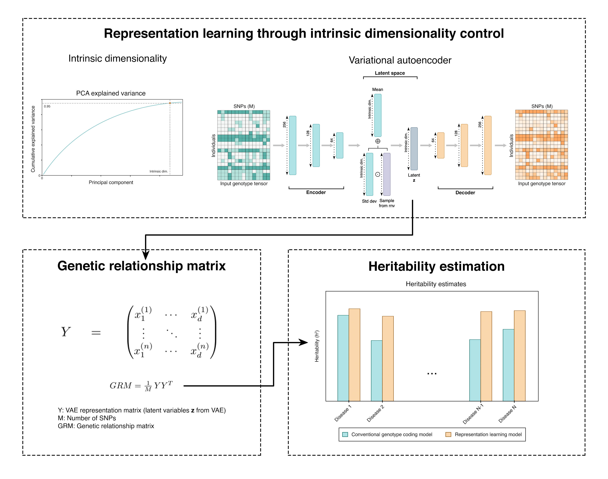

# HERL (Heritability Estimation by Representation Learning)

Deep generative modelling and representation learning of high-dimensional 
genotype data for heritability estimation.

Standard genomic-heritability methods (e.g. GCTA-GREML) build a genetic 
relationship matrix (GRM) directly from standardized SNP genotypes which 
is a strictly linear summary of relatedness. This project explores whether 
a variational autoencoder (VAE) that compresses each individual's 
genotype into low-dimensional representations can provide input for a 
GRM that yields improved heritability estimates. The latent representations 
should be able to capture nonlinear structure (dominance, epistasis, 
population structure) that a linear GRM cannot.



---

## Method

The pipeline has four core stages:

```
raw PLINK binaries (.bed/.bim/.fam)
        │
        ▼
  ┌───────────────┐   Automated QC + LD pruning via PLINK
  │ 1. Preprocess │   PyArrow ingest → imputed Numpy binary (.npy)
  └───────────────┘
        │  independent genotypes (individuals × independent SNPs)
        ▼
  ┌───────────────┐   Categorical VAE encoder → latent code z per individual
  │ 2. Represent  │   (Fixed latent dim to compress independent markers)
  └───────────────┘
        │  Y = matrix of latent codes  (n individuals × d latent dims)
        ▼
  ┌───────────────┐   GRM = (1/M) · Y Yᵀ        (M = number of SNPs)
  │ 3. Relate     │   written in GCTA binary format
  └───────────────┘
        │  GRM + phenotype (case/control, or gene expression)
        ▼
  ┌───────────────┐   GCTA --reml  →  V(G)/Vp   (SNP heritability, h²)
  │ 4. Estimate   │
  └───────────────┘
```

### 1. Preprocessing & LD pruning

HERL operates directly on raw PLINK binaries. The preprocessing modules 
execute a bioinformatics pipeline in C++ before neural network training:
1. **Quality Control:** Filters out missingness, low Minor Allele Frequency 
(MAF), and Hardy-Weinberg violations.
2. **LD Pruning (Optional):** Iteratively prunes highly correlated haplotype blocks 
(`--indep-pairwise`).
3. **Ingestion:** Extracts independent markers, parses them at into memory 
via PyArrow, mean-imputes residual missingness, and saves a Numpy binary 
(`.npy`).

### 2. Representation learning (Categorical VAE)

A fully connected VAE encodes the independent genotype tensor into a latent 
distribution and reconstructs it.
- **Input encoding (dominance effects):** The encoder natively one-hot 
encodes the continuous imputed dosages into three distinct probability 
states (flattening the space to `N * 3`). This allows the network's first 
layer to independently learn non-additive (dominance) genetic effects.
- **Categorical reconstruction:** The decoder outputs a 3D tensor of logits 
(`Batch, SNPs, 3`). The VAE minimizes a Evidence Lower Bound (ELBO) using 
a categorical cross-entropy reconstruction loss.
- **Training dynamics:** Optimization utilizes Adam with L2 weight decay, `ReduceLROnPlateau` learning rate scheduling, and KL divergence annealing to prevent posterior collapse.

### 3. Genetic relationship matrix (GRM)

The per-individual latent codes form a representation matrix `Y`. The GRM is 
computed as `GRM = (1/M) · Y Yᵀ`, then serialized to GCTA's binary triplet 
(`.grm.bin`, `.grm.N.bin`, `.grm.id`) alongside a phenotype (`.phen`) file.

### 4. Heritability estimation

Heritability is estimated by restricted maximum likelihood (GREML) with 
[GCTA](https://yanglab.westlake.edu.cn/software/gcta/) (`--reml`), reporting 
`V(G)/Vp`. [LDAK](https://dougspeed.com/ldak/) is supported as an alternative.

---

## Reconstruction quality & determinism

While the network optimizes over categorical cross-entropy, quantitative 
genetics tools (like GRMs) require single continuous dosages to compute 
covariance. 

To deterministically use the VAE outputs, the final evaluation loop derives the 
continuous expected dosage by marginalizing the probabilities: `Expected 
Dosage = P(Heterozygous) + 2 * P(Homozygous Alt)`. This preserves the soft 
probabilistic uncertainty learned by the VAE without breaking downstream 
mathematical compatibility. 

Training is actively monitored using Macro F1 (classification accuracy across 
rare alleles) and R-squared metrics.

---

## Repository layout

The code is organized by pipeline stage:

```
preprocessing/  Preprocess — automated PLINK QC + PyArrow data loading
  wtccc.py                 LD pruning + imputation for WTCCC genotypes
  gtex.py                  per-gene cis genotype windows (GTEx)
vae/            Represent  — configurable VAE library + training scripts
  encoder.py               One-hot Encoder module
  decoder.py               Categorical Decoder module
  loss.py                  ELBO calculation (Cross-Entropy + KL Divergence)
  eval.py                  Metrics (Macro F1, R-Squared, Recon Error)
  model.py                 VAE architecture definition (nn.Module)
  configs/                 JSON configs: wtccc, wtccc_multi, gtex_cis
  train_wtccc.py           Execution script: coordinates training loop + wandb
  train_gtex_cis.py        Execution script for GTEx gene cis window
heritability/   Relate & Estimate — GRM construction, GCTA runner
  grm_wtccc.py             build GRM + phenotype + GCTA binaries (WTCCC)
  grm_gtex_cis.py          build GRM + GCTA binaries (GTEx cis)
  gcta.py                  run GCTA GREML in parallel across directories
  aggregate.py             crawl .hsq outputs → single results CSV
analysis/       Analyse    — Exploratory data analysis
  eda.py                   Global sparsity and MAF spectrum histograms
  pca.py                   PCA explained variance plot
  explore.py               t-SNE of latent space + reconstruction error scatter
```

Datasets covered: **WTCCC** (seven case/control diseases: BD, CAD, CD, HT, RA, 
T1D, T2D) and **GTEx** (gene-level / cis-eQTL).

---

## Usage

The stages are separate command-line scripts and share `--data_path` / `--output_dir` arguments.
A typical WTCCC run for one disease:

```bash
# 1. Train the VAE and write latent representations + expected reconstructions
#    [Optional: append --pruned to use LD-pruned SNPs]
python vae/train_wtccc.py \
    --config vae/configs/wtccc.json --disease BD \
    --data_path /work/long_lab/for_Ariel/BD \
    --output_dir /work/long_lab/sasha/heritability/out/WTCCC/BD/BD_128

# 2. Build the GRM (from the latents) + phenotype + GCTA binaries
python heritability/grm_wtccc.py \
    --disease BD --latent 128 \
    --data_path /work/long_lab/for_Ariel/BD \
    --output_dir /work/long_lab/sasha/heritability/out/WTCCC/BD/BD_128

# 3. Estimate heritability with GCTA (external tool)
gcta64 --reml \
    --grm-bin /work/long_lab/sasha/heritability/out/WTCCC/BD/BD_128/BD \
    --pheno   /work/long_lab/sasha/heritability/out/WTCCC/BD/BD_128/BD.phen \
    --out     /work/long_lab/sasha/heritability/out/WTCCC/BD/BD_128/BD_reml
```

### Input format

Genotype input relies on prefix paths to raw PLINK binary triplets (`.bed`, `.bim`, `.fam`). WTCCC case/control status is inferred from the individual ID prefix in the `.fam` file.

---

## Requirements

- Python 3.9+
- `torch`, `numpy`, `pandas`, `scikit-learn`, `matplotlib`, `pyarrow`
- External: [PLINK 1.9](https://www.cog-genomics.org/plink/) and [GCTA](https://yanglab.westlake.edu.cn/software/gcta/)

The models are implemented in **PyTorch** and run on GPU when available (CPU otherwise).
